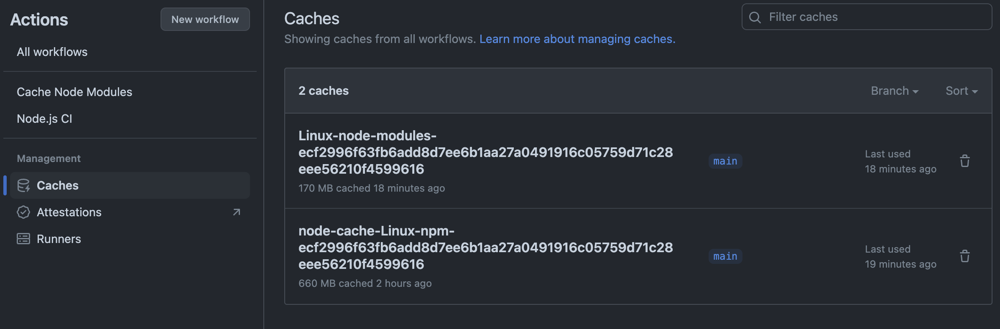

# NodeのCIを試すだけ

**`actions/setup-node@v3`を使う**

https://github.com/actions/setup-node/tree/main

-   `.npm`をキャッシュする

```
    - uses: actions/checkout@v3
    - uses: actions/setup-node@v3
        with:
            node-version: '20'
            cache: 'npm'
    - run: npm ci
```

**node_modulesをキャッシュする**

-   `setup-node`はデフォルトでキャッシュを作成しない
-   `with > cache`を指定しないようにすれば環境を作れる

```
    - uses: actions/checkout@v3
    - uses: actions/setup-node@v3
        with:
            node-version: '20'
    - uses: actions/cache@v3
        id: node_modules_cache
        with:
            path: '**/node_modules'
            key: ${{ runner.os }}-node-modules-${{ hashFiles('**/package-lock.json') }}
            restore-keys: |
                ${{ runner.os }}-node-modules-
    - run: npm ci
```

## キャッシュの再検証

キャッシュのキーに`package-lock.json`のハッシュ値を使用している



## 備考

**npm installは`package-lock.json`を更新する**

-   `npm ci`を使った方が良い
-   `setup-node`のサンプルでも`npm ci`を使っている
    https://qiita.com/mstssk/items/8759c71f328cab802670

**npm ciはnode_modulesを一度削除する**

-   `npm ci`の実行時に`node_modules`が存在する場合，一度削除してから`node_modules`を入れ直すらしい
-   `node_modules`をキャッシュしても削除されてしまいそう
